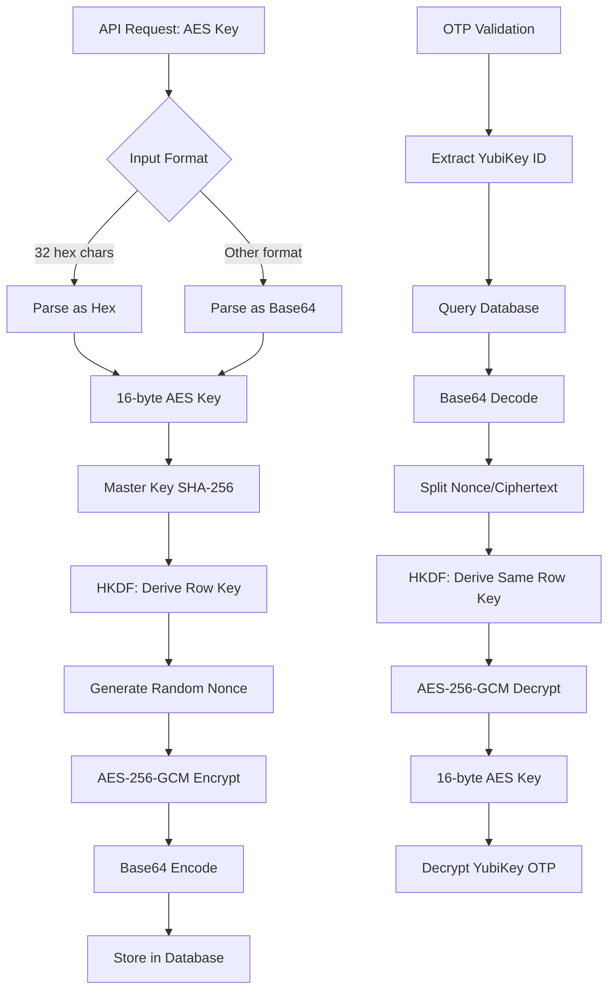

# Security

## How YubiKey AES Keys Are Stored

YubiKey AES keys are encrypted before storage using AES-256-GCM encryption.

### Encryption Process

1. **Master key** is hashed with SHA-256
2. **Row key** is derived using HKDF with YubiKey ID as info parameter
3. **AES key** is encrypted with AES-GCM using the row key
4. **Result** is base64-encoded and stored in database

### Storage Format

```text
Database: key_id="cccccccccccc", encrypted_key="base64(nonce+ciphertext)"
```

### Security Properties

- Each YubiKey gets unique encryption key
- Random nonce prevents identical ciphertext
- GCM provides authentication (tamper detection)
- Only 16-byte AES keys are encrypted, metadata is plaintext

### Master Key

Generate with:

```bash
openssl rand -base64 48
```

Master key compromise requires re-encryption of all stored keys.

## Encryption Flow



## Standards Compliance

- **FIPS 140-2**: Uses FIPS-approved algorithms (AES-256, SHA-256, HKDF)
- **NIST SP 800-108**: HKDF key derivation follows NIST recommendations
- **RFC 5869**: HKDF implementation per RFC specification
- **RFC 5116**: AES-GCM authenticated encryption per RFC standard
